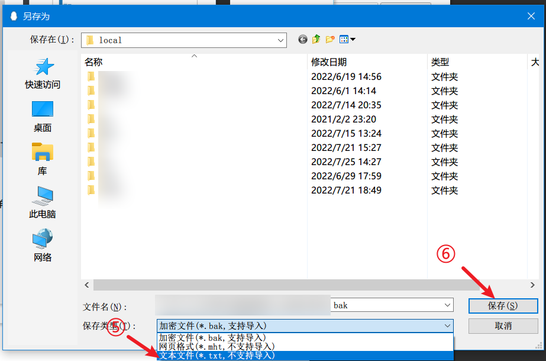

# 分析QQ群词频!

用来分析你和苟裙友的聊天记录的词频。

## Usage

1. `git clone`代码，这个我不说了。

2. 安装所需依赖：

   ```bash
   > pip install -r requirements.txt
   ```

3. 找到你想要迫害的群，按照如下步骤操作：

   

   

   

   最好在这里把文件名改一改，改成英文的，比较稳妥。

4. 打开VSCode（别告诉我你没有），并且把之前导出的txt文件和`git clone`下来的文件放到一个目录下。

5. 把这里边的前几行全删了，让消息记录顶格。

   

   

6. 把该死的BOM删掉。

   

   

7. 现在可以用了，打开Console，输入类似于这样的命令：

   ```bash
   > python main.py test.txt group 111222333 30
   > python main.py test.txt friend NAME 30
   ```

   + `test.txt` 是你保存的**文件名**
   + `group/friend` 
      + 如果是群聊就是 `group`
      + 如果是好友就是 `friend`
   + `111222333/NAME`
      + 如果是好友模式，你需要输入文件里显示的**用户名**
      + 如果是群聊模式，你需要输入这个人的**QQ号**
   + `30` 是筛选出前多少个

